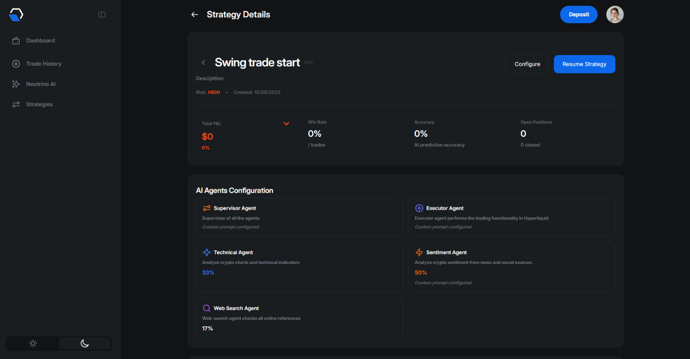
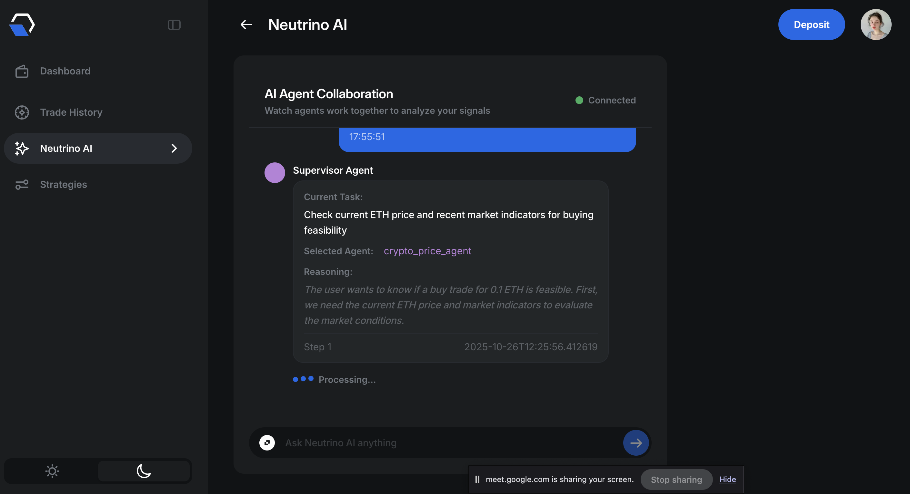
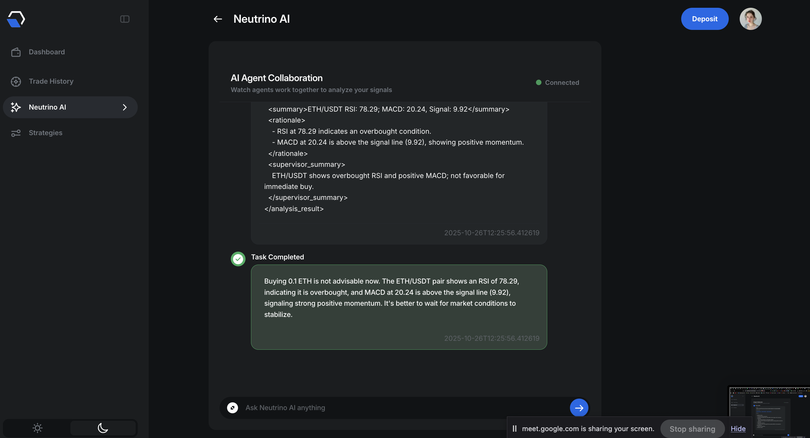
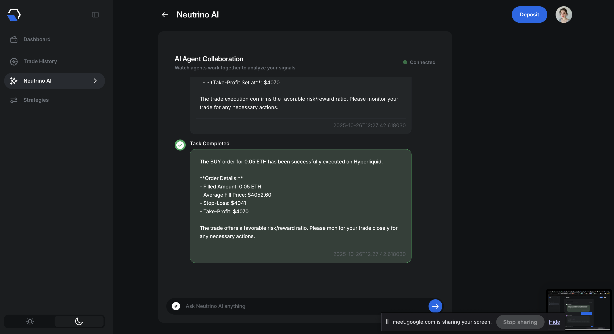
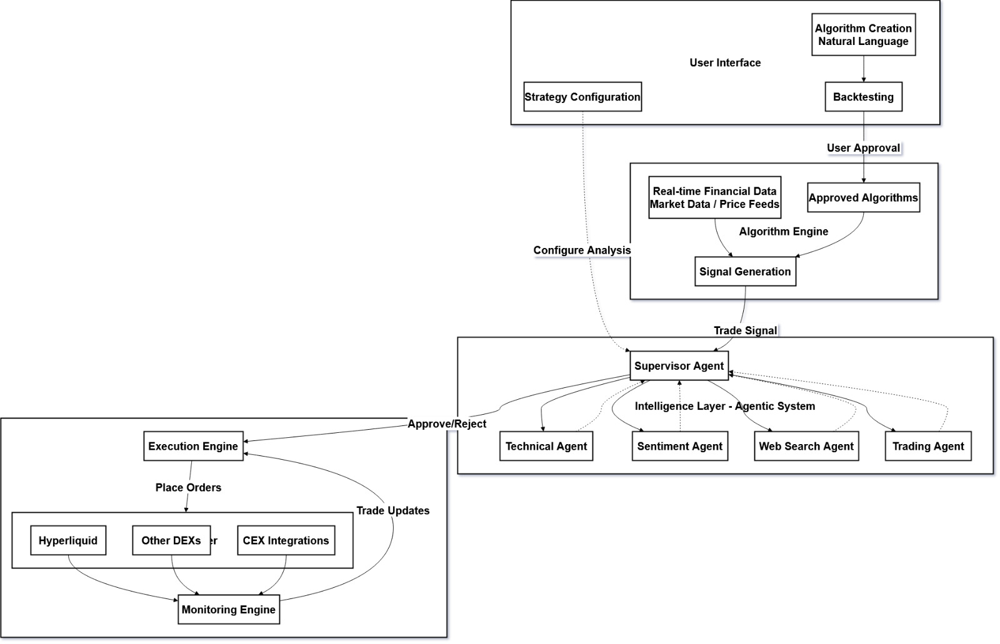

# Cognix: Trade with Intelligence

An intelligent trading system that combines natural language algorithm creation, multi-agent analysis, and automated execution on Hyperliquid DEX with bridging capabilities via Avail Nexus.

## 🌟 Overview

This platform revolutionizes algorithmic trading by allowing users to create trading strategies in natural language, validate them through backtesting, and execute them via an intelligent multi-agent system that performs comprehensive technical and sentiment analysis before placing trades.

## Product Screens







## 🏗️ Architecture

### System Components


## 🚀 Key Features

### 1. Natural Language Algorithm Creation
- Create trading algorithms using plain English
- No coding required - describe your strategy naturally
- Automatic conversion to executable trading logic
- Support for complex conditions and multi-indicator strategies

### 2. Intelligent Backtesting
- Automatic backtesting upon algorithm creation
- Historical performance metrics and visualizations
- Risk-adjusted returns analysis
- User approval workflow before live deployment

### 3. Multi-Agent Intelligence System
The platform employs a sophisticated agentic architecture:

#### **Supervisor Agent**
- Orchestrates communication between specialist agents
- Makes final trading decisions based on consensus
- Manages workflow and prioritization

#### **Technical Agent**
- Access to 200+ technical indicators via TAAPI.io
- Multi-timeframe analysis
- Support for any trading interval
- Advanced pattern recognition

#### **Sentiment Agent**
- Real-time news sentiment analysis
- Google News API integration
- ML-based sentiment scoring
- Market mood assessment

#### **Trading Agent**
- Custom algorithms for stop-loss identification
- Take-profit level calculation
- Support/resistance analysis
- Risk-to-reward optimization

#### **Web Search Agent**
- General information retrieval
- Market context gathering
- Event-driven intelligence

### 4. Configurable Agent Behavior
- Customize analysis parameters
- Enable/disable specific agents (e.g., sentiment-only analysis)
- Fine-tune risk tolerance
- Set custom approval thresholds

### 5. Secure Fund Management
- API wallet system - users retain full custody
- API wallets cannot withdraw user funds
- Execution-only permissions
- JWT-based authentication via Privy

### 6. Seamless Asset Bridging
- Avail Nexus SDK integration
- Direct deposit to Hyperliquid in single flow
- Cross-chain asset management

## 🛠️ Technology Stack

### Frontend
- **Framework**: Next.js
- **Deployment**: Vercel
- **Bridge Integration**: Avail Nexus SDK
- **Real-time Communication**: WebSockets
- **Authentication**: Privy wallet connection

### Execution Engine
- **Runtime**: Node.js
- **Database**: MongoDB
- **Trading Integration**: Hyperliquid Client
- **Authentication**: JWT access tokens
- **Key Features**:
  - Strategy CRUD operations
  - API wallet management
  - Order placement and management
  - User and strategy storage

### Agentic Backend
- **Framework**: FastAPI
- **Agent Orchestration**: LangGraph, LangChain
- **Communication Protocol**: Model Context Protocol (MCP)
- **WebSocket Server**: FastAPI WebSocket
- **Deployment**: AWS EC2
- **External APIs**:
  - TAAPI.io (200+ technical indicators)
  - Google News API
  - Custom ML sentiment analyzer

## 📊 How It Works

### Workflow

1. **Algorithm Creation**
```
   User describes strategy → NLP processing → Algorithm generated
```

2. **Validation Phase**
```
   Auto-backtesting → Performance metrics → User reviews → Approval
```

3. **Live Monitoring**
```
   Real-time market data → Algorithm evaluation → Signal generation
```

4. **Intelligent Execution**
```
   Signal triggered → Agentic team analysis → Multi-factor validation → Trade execution
```

### Decision Making Process

Unlike traditional bots that execute trades automatically when conditions are met, this platform:

1. **Receives Signal**: Algorithm conditions are met
2. **Triggers Analysis**: Supervisor agent activates specialist agents
3. **Multi-Factor Analysis**:
   - Technical indicators across timeframes
   - Current market sentiment
   - Support/resistance levels
   - Risk-to-reward assessment
4. **Consensus Building**: Agents collaborate and vote
5. **Execution**: Trade placed only if all factors favor the signal

## 🔐 Security Features

- **Non-custodial Design**: Users maintain full control of funds
- **API Wallet Isolation**: Trading wallets have execution-only permissions
- **JWT Authentication**: Secure session management
- **Private Key Management**: Keys never exposed to backend

## 📈 Use Cases

- **Trend Following**: Create strategies based on moving averages and momentum
- **Mean Reversion**: Identify overbought/oversold conditions
- **Sentiment Trading**: Execute based on news and social sentiment
- **Multi-Factor Strategies**: Combine technical, fundamental, and sentiment signals
- **Risk-Managed Trading**: Automated stop-loss and take-profit management

## 🎯 Competitive Advantages

1. **Natural Language Interface**: Democratizes algorithmic trading
2. **AI-Powered Validation**: Reduces false signals through multi-agent consensus
3. **Customizable Intelligence**: Users control agent behavior and analysis depth
4. **Seamless Onboarding**: Integrated bridging eliminates cross-chain friction
5. **Non-Custodial Security**: Users never sacrifice fund control

## 🔄 Data Flow
```
Market Data → Algorithm Engine → Signal Generation → 
Agentic Analysis → Execution Engine → DEX/CEX → 
Monitoring → User Dashboard
```

## 📦 Components

### User Interface Layer
- Algorithm builder with natural language input
- Strategy configuration dashboard
- Backtesting results visualization
- Real-time trade monitoring
- Performance analytics

### Algorithm Engine
- Signal generation based on approved algorithms
- Real-time market data processing
- Multi-exchange price feed aggregation

### Intelligence Layer
- Supervisor agent coordination
- Specialist agent execution
- Inter-agent communication via MCP
- Consensus-based decision making

### Execution Layer
- Multi-exchange order routing
- Position monitoring
- Risk management
- Performance tracking

## 🌐 Supported Platforms

- **Primary**: Hyperliquid DEX
- **Extensible**: Other DEXs and CEX integrations
- **Bridge**: Avail Nexus for cross-chain assets

## 📝 Configuration Options

Users can configure:
- Which agents to enable/disable
- Analysis depth and timeframes
- Risk parameters (stop-loss %, take-profit targets)
- Sentiment weight in decision making
- Technical indicator preferences
- Execution speed vs. accuracy tradeoffs

## 🚦 Getting Started

### Prerequisites
- Web3 wallet (supported by Privy)
- Funds on supported chains (or bridge via Avail Nexus)
- Basic understanding of trading concepts

### Quick Start
1. Connect wallet via Privy
2. Deposit or bridge assets to Hyperliquid
3. Create your first algorithm in natural language
4. Review backtest results
5. Approve algorithm for live trading
6. Configure agent behavior (optional)
7. Monitor trades and performance

## 🔮 Future Enhancements

- Support for additional DEXs and CEXs
- Advanced portfolio management features
- Social trading and strategy sharing
- Enhanced ML models for sentiment analysis
- Custom agent creation framework
- Mobile application

## 🤝 Contributing

This is a proprietary trading platform. For partnership inquiries or integration requests, please contact the development team.

## ⚠️ Disclaimer

Trading cryptocurrencies carries significant risk. This platform is provided as-is without guarantees of profitability. Users are responsible for their own trading decisions and should only trade with capital they can afford to lose. Past performance does not guarantee future results.

## 📧 Support

For technical support, feature requests, or bug reports, please contact our support team through the platform interface.

---

**Built with ❤️ for intelligent, democratized algorithmic trading**
